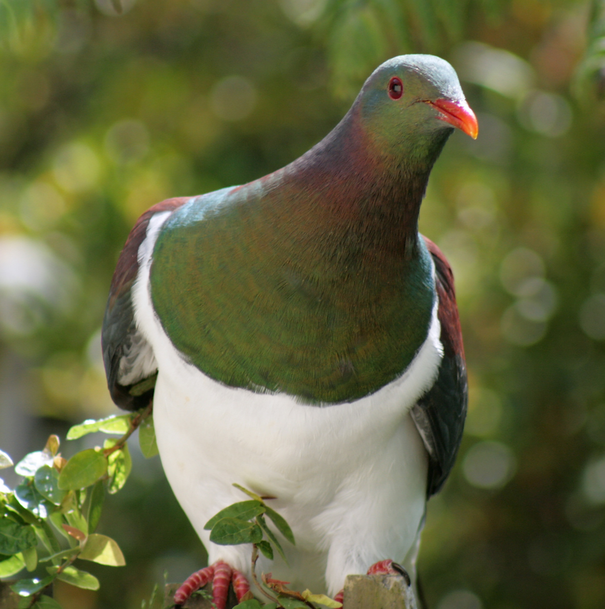

Sonic acts 2016 day 2

---

The night falls very fast and lasts for a long time - Amazonian shaman

God engendered an egg,
...
The sword engendered David
David engendered crimson
Crimson engendered the duke
The duke engendered the Marquis
The Marquis engendered the Count
The count, that is me

If you repeat the word body many times it becomes something else

Body

- Volumnous / Voluminous
- Empty

It was as artificial as the world must have been when it was created

----

bits of film from

- Black narcissus
- Strange days

The rights of the indigenous are the best weapon against climate chaos

---

Marach; shamanism, likened to film.

film: Michael Snow — La ... Central 3.15 hours

Bloxburgh FM water road education

---

Artistic research, not really artistic, not really art.

One plus one is very often eight.

- difference between syntax and semantics
- non-mathematical understanding

- point of view of Flux / discontinuity ~ David Rhoden
- elevating consciousness
- don't know what it will become

dr. Rachel Armstrong
inhabiting in space with plants, etc

benjamin bratton article transmediale and blog in NY times

----

Sally-Jane Norman; Q/A.

victor turner *antropologist*

- "when persons groups sets of ideas move from one level of style/organization... to another level"
- there has to be an interfacial region (an interval)
- when the past is momentary negated, suspended
- when the future is not yet begun
- pure potentiality, when everything trembles in the balance

mentions http://www.thisiscolossal.com/2014/07/hubert-duprat-caddisflies/

beat the sun, so it no longer so fast, has to limp across the sky. so we have time to do what we need
mahwe - conquer death (half mortal)

[Māui (Māori mythology)](https://en.wikipedia.org/wiki/M%C4%81ui_(M%C4%81ori_mythology))

